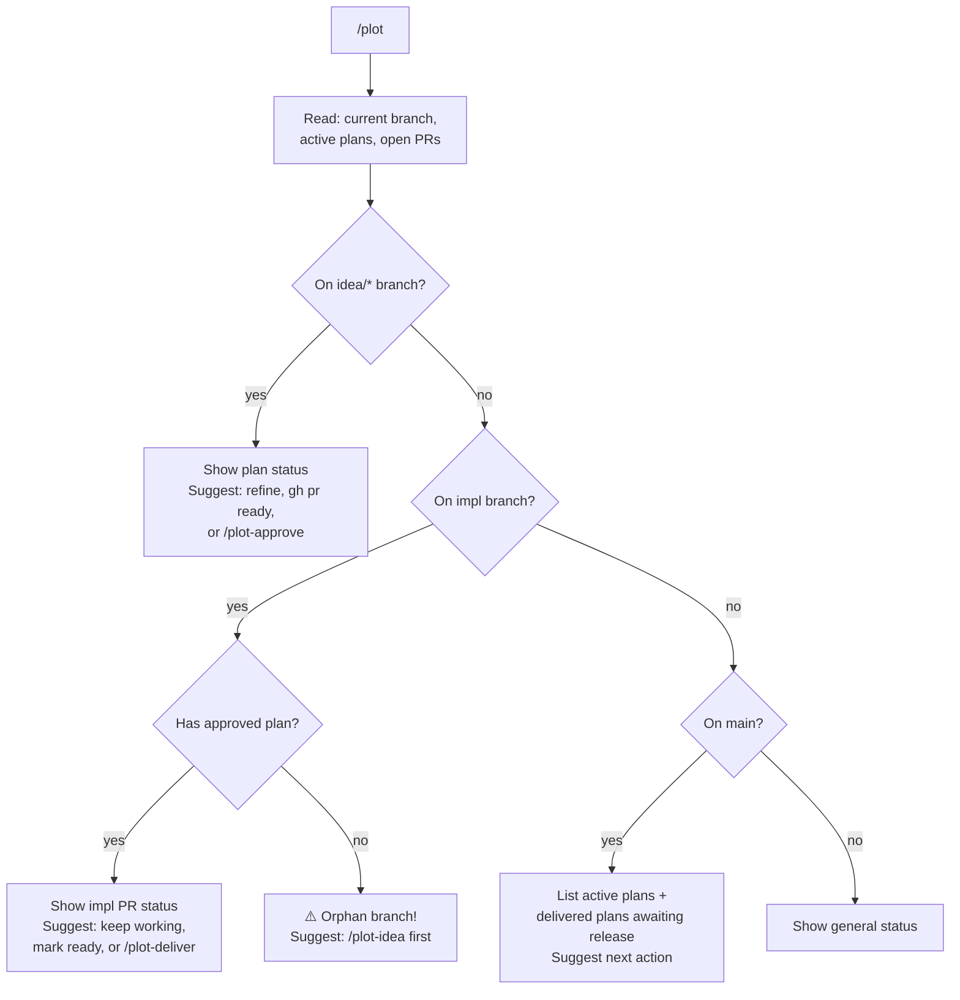

# Plot: Smart Dispatcher

Show current workflow state and suggest next steps.

## Setup

Add a `## Plot Config` section to your project's `CLAUDE.md`:

    ## Plot Config
    - **Project board:** <your-project-name> (#<number>)  <!-- optional, for `gh pr edit --add-project` -->
    - **Branch prefixes:** idea/, feature/, bug/, docs/, infra/
    - **Plan directory:** docs/plans/
    - **Archive directory:** docs/archive/

## Instructions

You are the Plot dispatcher. Analyze the current git state and suggest the appropriate next action.

### Decision Tree



### 1. Read State

Gather context in parallel:

```bash
# Current branch
BRANCH=$(git branch --show-current)

# Active plans on main
ls docs/plans/*.md 2>/dev/null

# Archived plans
ls docs/archive/*.md 2>/dev/null

# Open PRs on idea/ branches
gh pr list --json number,title,headRefName,isDraft,state --jq '.[] | select(.headRefName | startswith("idea/"))'

# Open PRs on impl branches (feature/, bug/, docs/, infra/)
gh pr list --json number,title,headRefName,isDraft,state --jq '.[] | select(.headRefName | startswith("feature/") or startswith("bug/") or startswith("docs/") or startswith("infra/"))'
```

Also run the bash helpers if a specific slug is in context:
- `.claude/skills/plot/scripts/plot-pr-state.sh <slug>` — plan PR state
- `.claude/skills/plot/scripts/plot-impl-status.sh <slug>` — impl PR states

### 2. Detect Current Context

**If on an `idea/*` branch:**
- Read the plan file from `docs/plans/<slug>.md` on this branch
- Check plan PR state (draft / ready / merged)
- Suggest:
  - If plan PR is draft: "Plan is still a draft. Refine it, then run `gh pr ready <number>` when ready for review."
  - If plan PR is non-draft (ready for review): "Plan is ready for review. Run `/plot-approve <slug>` to merge and create impl branches."
  - If plan PR is merged: "Plan is already approved. Run `/plot-approve <slug>` to create impl branches (if not already created)."

**If on an impl branch (`feature/*`, `bug/*`, `docs/*`, `infra/*`):**
- Check if there's a corresponding approved plan in `docs/plans/<slug>.md` on main
- If plan exists: show impl PR status, suggest keep working / mark ready / `/plot-deliver`
- If no plan exists: warn "Orphan branch — no approved plan found. Consider running `/plot-idea` first."

**If on `main`:**
- List all active plans with their phases
- List any delivered (archived) plans awaiting release
- Show overall status summary
- Suggest next action based on what's pending

**Otherwise:**
- Show general status: active plans, open PRs, recent archives

### 3. Detect Issues

Flag any problems found:

- **Orphan impl branches**: branches with `feature/`, `bug/`, `docs/`, `infra/` prefix that have no corresponding plan in `docs/plans/`
- **Phase mismatches**: plan says Draft but PR is non-draft, or plan says Approved but PR is still open
- **Stale drafts**: impl PRs that have been in draft state for a long time

### 4. Status Summary

Print a clear summary:

```
## Plot Status

### Active Plans
- `<slug>` — Phase: <phase> | Plan PR: #<n> (<state>) | Impl PRs: <count> merged / <count> total

### Issues
- ⚠️ <issue description>

### Suggested Next Step
> <specific command or action>
```

### 5. Phase Reference

| Phase | Meaning | Trigger |
|-------|---------|---------|
| Draft | Plan being written/refined | `/plot-idea` |
| Approved | Plan merged, impl branches created | `/plot-approve` |
| Delivered | All impl PRs merged, plan archived | `/plot-deliver` |
| Released | Included in a versioned release | `/plot-release` |
